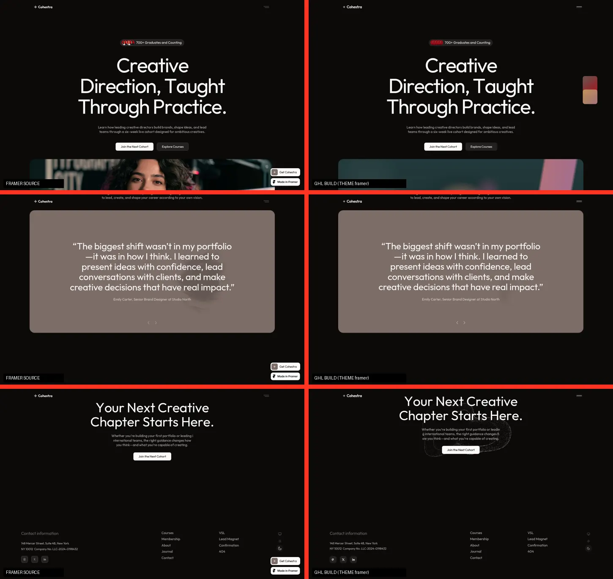

[← Back to the gallery](../../README.md)

# Framer > GoHighLevel rebuild

A prompt and a build kit for cloning any Framer landing page into **one GHL Custom Code element**. Everything comes out pixel-matched with every animation, rebuilt as dependency-free HTML/CSS/JS, and reskinnable from a single config block.

| File | What it is |
|---|---|
| [`PROMPT.md`](./PROMPT.md) | The full brief. Fill the INPUTS block (Framer URL, palette, images, logo, fonts, GHL form) and paste it into Claude. |
| [`starter/fx-page.html`](./starter/fx-page.html) | Generic engine shell: config block, dual token sets, spring > CSS `linear()` converter, reveal / text-split / counter / marquee / parallax engine, mockup placeholder components, full-bleed breakout, GHL form embed with UTM passthrough. |
| [`builds/cohestra/`](./builds/cohestra/) | A finished run of the prompt against [cohestra.framer.media](https://cohestra.framer.media/): the build, report, GHL form CSS and setup guide. |

## The Cohestra build at a glance

- **Fidelity:** every section top and height within 1px of Framer at 1440 / 810 / 390, and the same line breaks.
- **Motion:** all 30 motion-map rows implemented, including the scroll-scrubbed 3D founders stack, the cursor image trail with idle demo, the cursor-reveal testimonial, the ticker, parallax and smooth scroll. Framer springs are converted with Framer Motion's own solver.
- **Performance:** Lighthouse mobile 94-96 performance, 95 accessibility, 100 best practices, CLS 0.001. The Framer original scores 33 in the same run.
- **GHL:** native form iframe with UTM + `page_source` passthrough, form Custom CSS, field map, and snapshot-ready setup.
- **Rebrand:** 7 colour primitives, brand, fonts, images, videos, links and section toggles, all in the config block. `const THEME = "framer" | "final"` flips between the untouched clone and your skin.

## How to run it on another Framer site

1. Fill the INPUTS block in `PROMPT.md`.
2. Paste it into Claude Code (it needs a browser to read computed styles; Claude Code on the web has Chromium preinstalled).
3. Expect the same 14-part report, plus a single HTML file to paste into GHL.

If the Framer site is password-protected or behind a bot wall, attach an HTTrack mirror (zip) and screenshots at 1440 / 810 / 390 instead.
